# Diagrams — Garage Brain (All Mermaid)

**Every diagram here also appears inline in `HLD.md` / `LLD.md`. This file collects them for reviews and for the docs-site gallery.**

> Tip: paste any block into https://mermaid.live or render via VitePress/Docsify/VS Code.

---

## 1. System Context

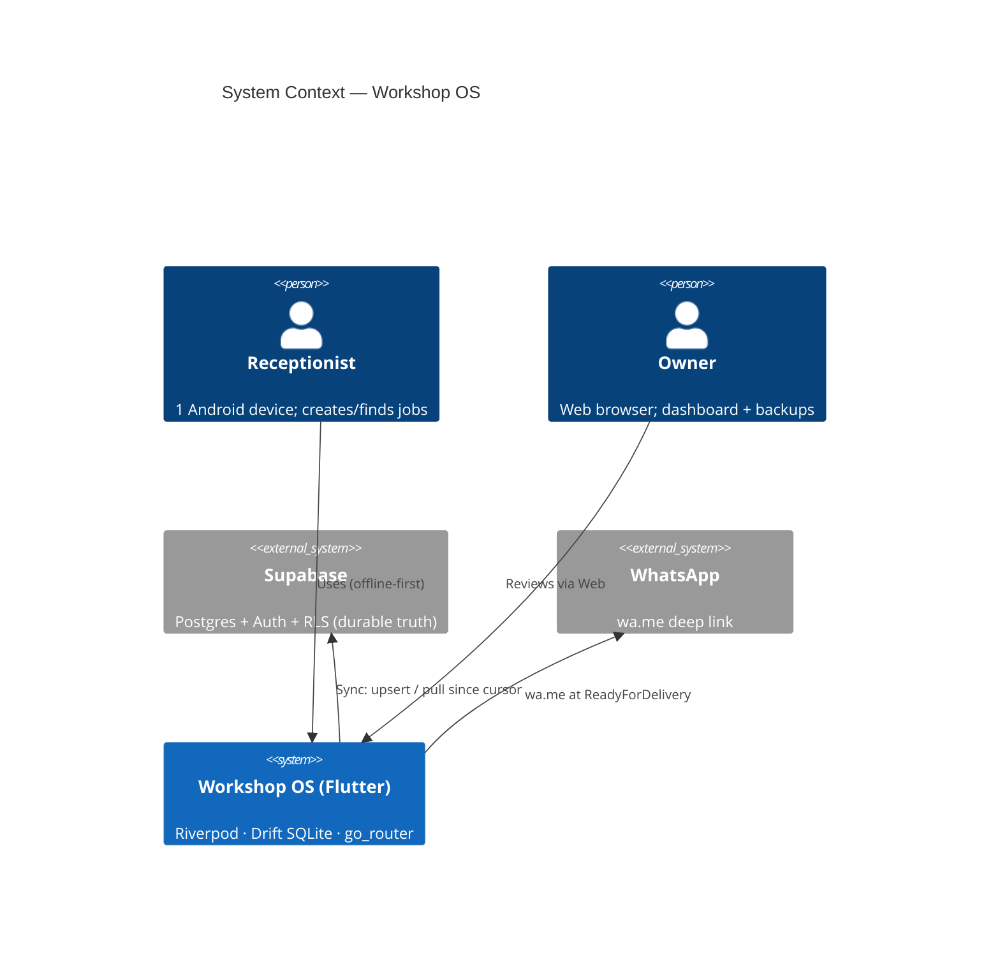

---

## 2. Container / Module Map

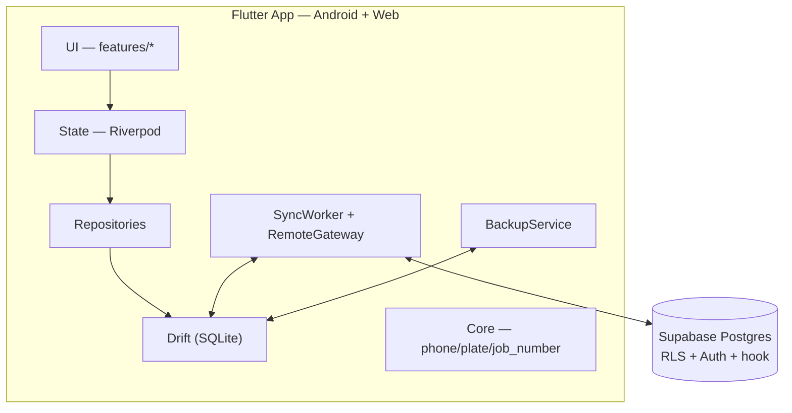

---

## 3. ER Diagram (Drift + Supabase)

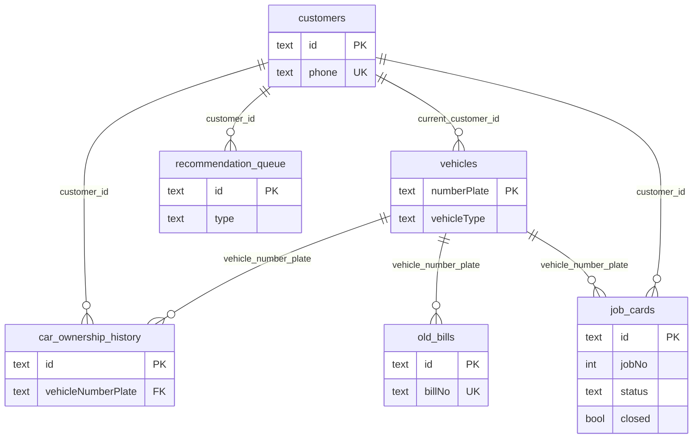

Full column detail in `LLD.md §2.1`.

---

## 4. Write Path — Create Job

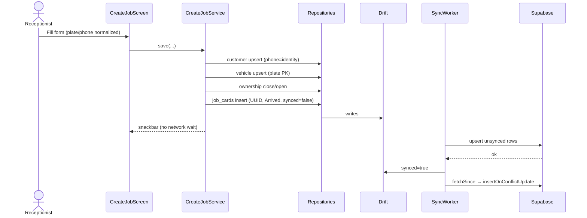

---

## 5. Read Path — Search + Dashboard

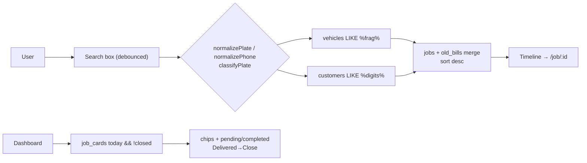

---

## 6. Sync Worker — Triggers + Pull→Push

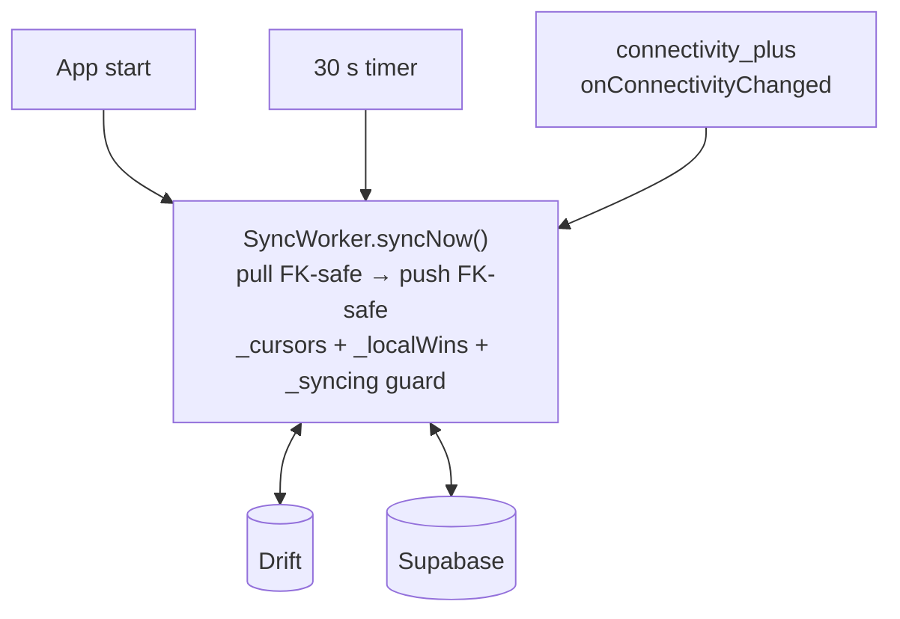

---

## 7. Auth + RLS

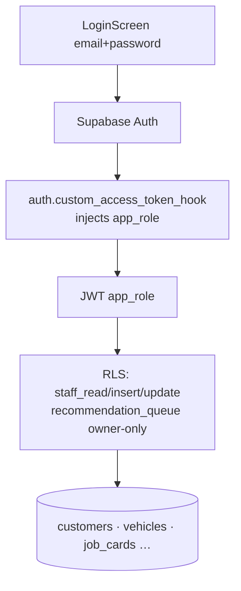

---

## 8. Job Status State Machine

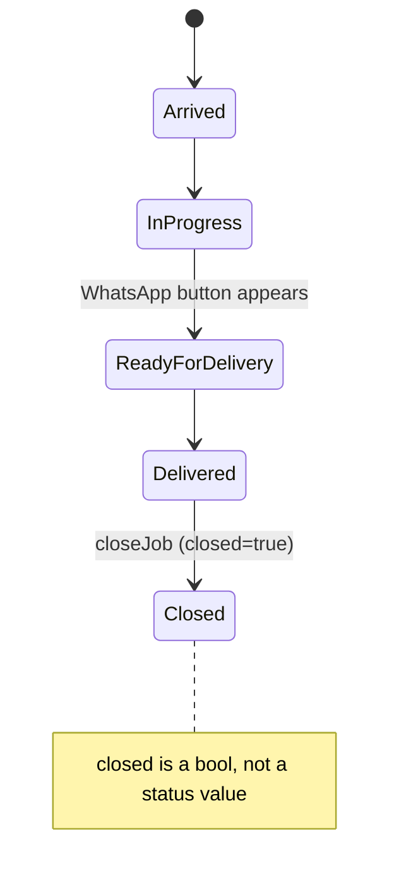

---

## 9. Deployment

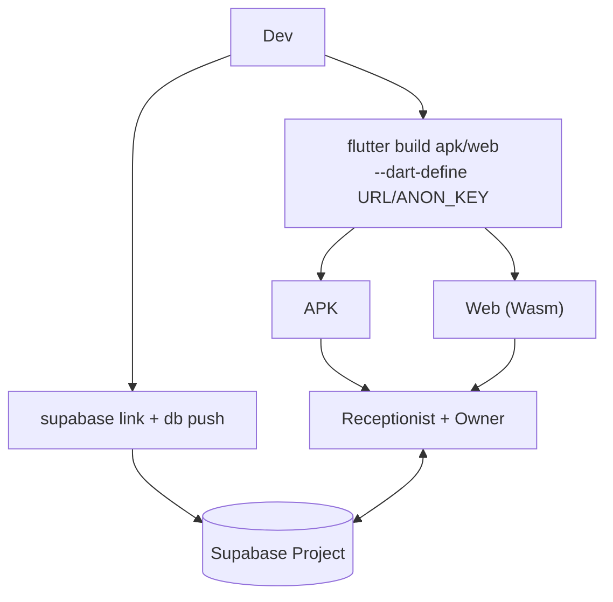

---

## 10. Backup / Restore

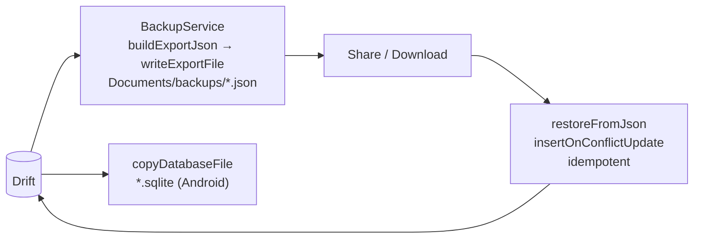

---

## 11. Routing Shell

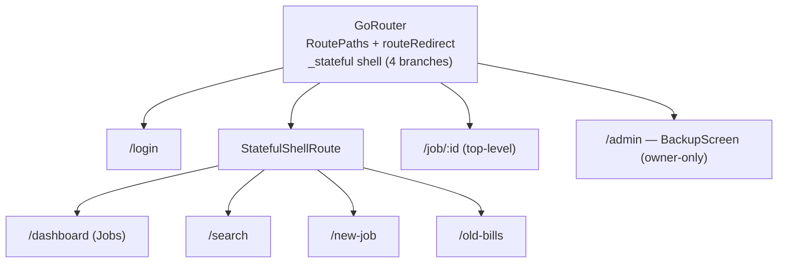
