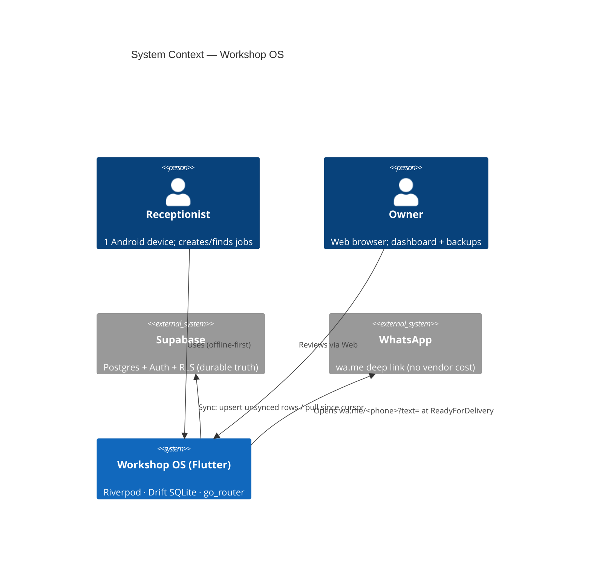
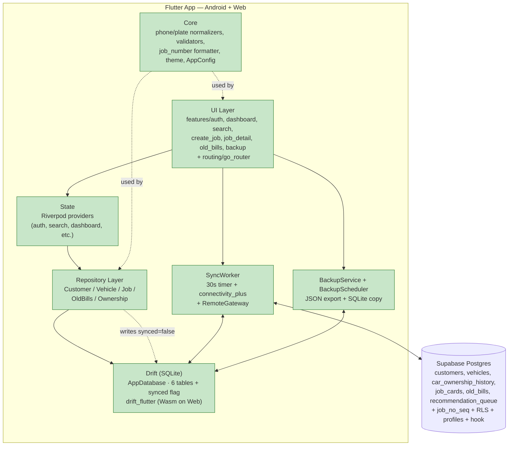
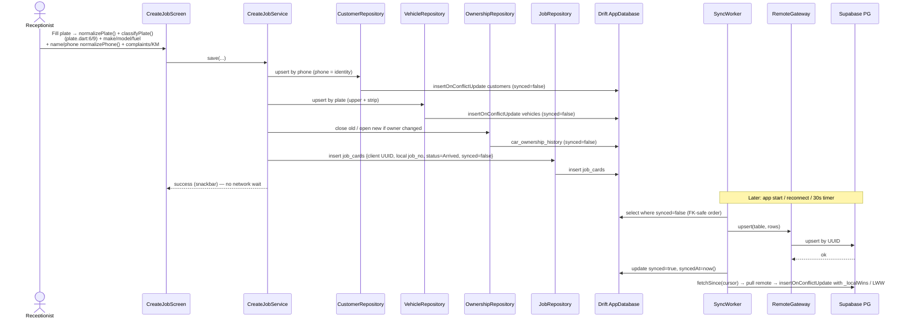
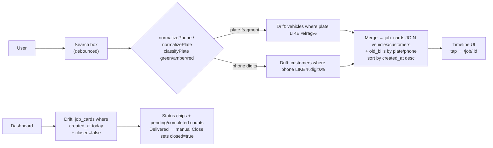
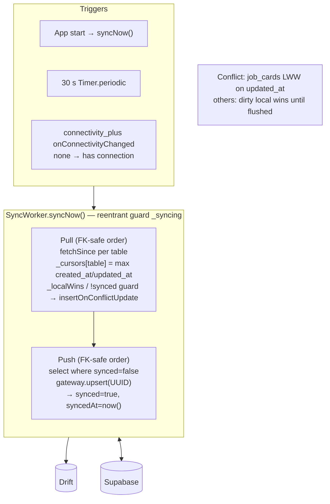
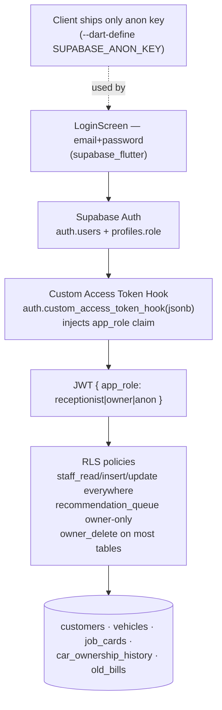
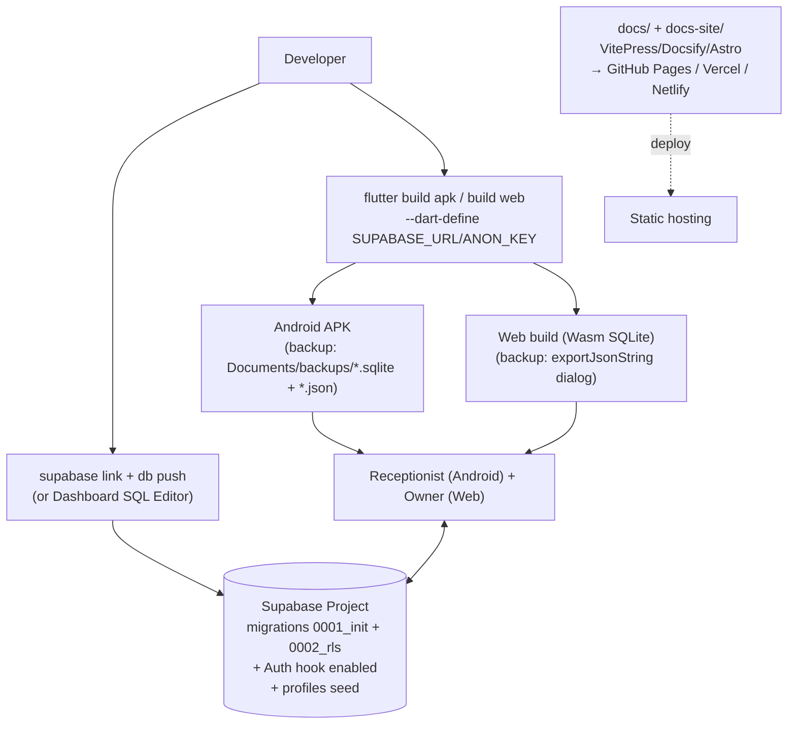

# High-Level Design (HLD) — Garage Brain / Workshop OS

**Version:** 1.0.0 · **Date:** 2026-08-22 · **Status:** Implemented (MVP)  
**Principles:** offline-first, local-first reads, single-writer LWW, zero-cost notification.

---

## 1. System Context (C4 L1)

**Boundary:** one physical workshop. No multi-tenant routing. Free-tier constraints assumed.

---

## 2. Container View (C4 L2)

**Dependency rule:** `UI → State → Repository → Drift`; screens never call Supabase except via `SyncWorker`/`RemoteGateway` and Auth.

---

## 3. Key Decisions & Trade-offs

| Decision | Choice | Consequence | Alternative rejected |
|---|---|---|---|
| Offline queue location | `synced` boolean in Drift only (`tables.dart:5`) | Server never knows pending; trivial LWW | Server-side pending table |
| PK generation | Client UUID v4 (`uuid` package) | Offline inserts upsert cleanly; no seq reservation complexity | Server-assigned `job_no_seq` only (would block offline) |
| Conflict | LWW on `updated_at` (trigger `touch_updated_at()` in `0001_init.sql`) | Low risk (1 writer) | CRDT / vector clock |
| Notification | `wa.me` deep link + `url_launcher` (`features/job_detail/whatsapp.dart`) | Zero cost/vendor | SMS gateway / Twilio |
| AuthZ shape | JWT `app_role` via `auth.custom_access_token_hook` (`0002_rls.sql`), RLS `staff_read/insert/update`, `recommendation_queue` owner-only | Client ships only anon key | Custom backend RBAC |
| Local DB on Web | `drift_flutter` Wasm (`app_database.dart:34`) | Single schema across platforms | IndexedDB wrapper |
| Backup | Dual: raw SQLite copy (Android) + weekly JSON export (cross-platform) | Web gravity: JSON is real restore path | Server-only backups |

---

## 4. Data Flow — Write Path (Create Job)

**Invariant:** screen success is decoupled from network; `synced` is the only queue signal.

---

## 5. Data Flow — Read Path (Search + Dashboard)

All reads prefer Drift; Supabase is **pull-on-sync** only (`sync_worker.dart:62` — pulls before pushes).

---

## 6. Synchronization Model

**Cursors:** in-memory `_cursors: Map<String,String>` keyed by table; iso strings, monotonic via `_bump` (`sync_worker.dart:81`). Single-device assumption makes volatile cursors acceptable; a full pull resyncs if process restarts.

---

## 7. Security & Privacy

- No `.env` committed; service key never shipped (AGENTS.md Secrets).
- Phone stored bare 10 digits, plate bare alnum; no PII beyond name+phone.
- Client UUIDs mean no sequence enumeration.

---

## 8. Deployment View

- Local dev without keys runs fully offline + auto-seeds demo data (`main.dart:28`).
- `flutter analyze && flutter test` is the CI gate (no backend needed for tests — in-memory Drift).

---

## 9. Non-Functional Mapping

| Concern | HLD answer |
|---|---|
| <3 s search | Drift indexes + local-only reads; no network in path |
| Zero loss | `synced=false` queue + aggressive push + idempotent upsert |
| Roles | JWT + RLS, owner gated `/admin`, `recommendation_queue` owner-only |
| Cost | Free Supabase tier + `wa.me`; no vendor |
| Backup | BackupService JSON (portable) + file copy (Android) + BackupScheduler |
| Testability | Pure normalizers/validators + in-memory Drift + fake `RemoteGateway`/`AuthGateway` |

---

## 10. Risks & Mitigations

| Risk | Mitigation |
|---|---|
| Lost cursors on restart → re-pull volume | Per-table `created_at` cursors; idempotent `insertOnConflictUpdate`; small dataset (<500 bills + daily jobs) |
| Plate garbage | Amber allows non-classic `6–11` alnum; red only on non-alnum/length fail — business rule wants accept |
| Job number gaps/collision offline | Client UUID PK + server `job_no_seq` as display number; offline placeholder `job_no` replaced on sync or range reservation later |
| Web file backup unsupported | JSON export dialog is primary restore; file copy is best-effort Android-only |
| Auth hook misconfig | Troubleshooting section in `app/README.md:246`; pre-seeded demo users in seed for offline dev |
