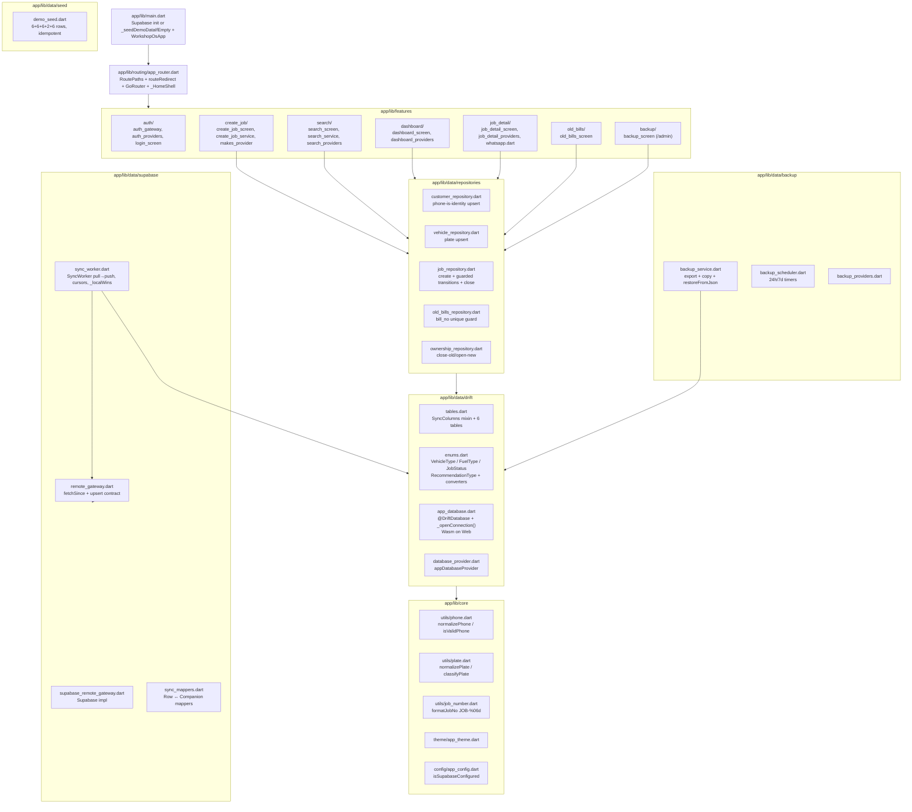
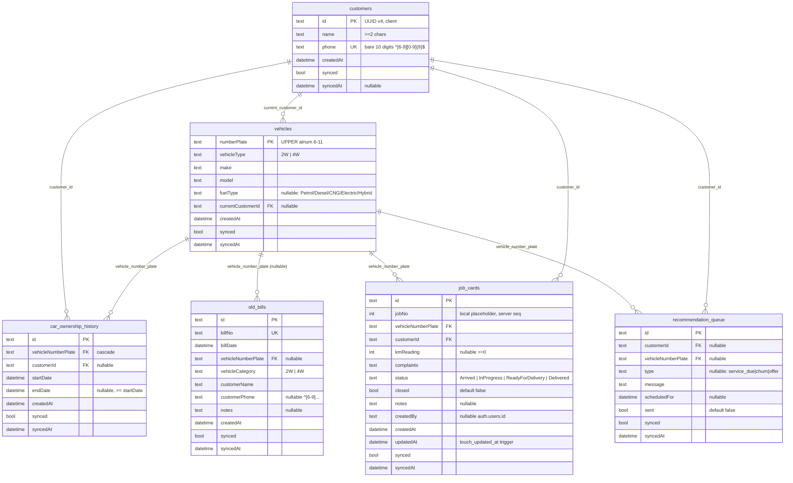
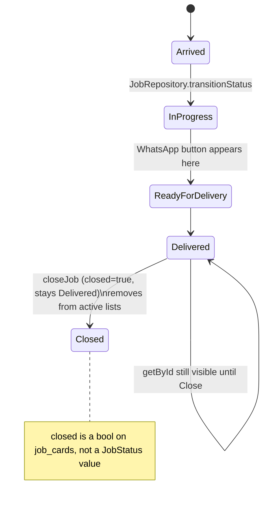

# Low-Level Design (LLD) — Garage Brain / Workshop OS

**Version:** 1.0.0 · **Date:** 2026-08-22 · **Status:** MVP implemented  
**Reads with:** `DESIGN.md §5`, `supabase/migrations/*`, `app/lib/data/drift/*`, `app/lib/features/*`, `app/lib/data/supabase/sync_worker.dart`.

---

## 1. Module Decomposition



---

## 2. Database — Drift Mirror + Supabase Truth

### 2.1 Drift tables (`tables.dart:1`)



- **SyncColumns mixin** (`tables.dart:5`): `synced BOOLEAN DEFAULT false`, `syncedAt DATETIME NULLABLE` — never exists server-side.
- **Database** (`app_database.dart:34`): `driftDatabase(name:'workshop_os', web: DriftWebOptions(sqlite3Wasm, driftWorker))`; `PRAGMA foreign_keys=ON` in `beforeOpen`.
- **Enums** (`enums.dart`): `TypeConverter` for `VehicleType`, `FuelType`, `JobStatus`, `RecommendationType`.

### 2.2 Supabase schema delta
Identical columns + constraints (`0001_init.sql`) but without `synced/syncedAt`. Extra server objects:
- `job_no_seq` + `job_cards.job_no DEFAULT nextval('job_no_seq')` + `UNIQUE`.
- `touch_updated_at()` trigger on `job_cards` sets `updated_at=now()` on update.
- Indexes: `idx_job_cards_vehicle_time`, `idx_customers_phone`, `idx_ownership_vehicle`, `idx_old_bills_phone`.
- RLS + `profiles` + `app_role()` + hook (`0002_rls.sql`) — see §5 below.

---

## 3. Core Utilities (pure Dart — unit-tested)

| File | Export | Contract | Tests |
|---|---|---|---|
| `core/utils/phone.dart:4` | `normalizePhone(raw)` | strip `[\s\-+]`, strip leading `91` if 12 chars; `isValidPhone` checks `^[6-9][0-9]{9}$`; `isValidRawPhone` normalizes first | `test/core/utils/phone_test.dart` (covers `+91`, dashes, O/0 not relevant to phone) |
| `core/utils/plate.dart:6` | `normalizePlate(raw)`, `classifyPlate(plate)` | upper + strip spaces/hyphens; `PlateFlag.green` = classic regex, `amber` = 6–11 alnum non-classic, `red` = non-alnum or length fail | `test/core/utils/plate_test.dart` (BH-series `21BH2345A` → amber) |
| `core/utils/job_number.dart` | `formatJobNo(int)` | `JOB-` + 6-digit pad; used in Dashboard + JobDetail + WhatsApp text | `test/core/utils/job_number_test.dart` |

No comments unless non-obvious; each validates in isolation.

---

## 4. Repositories (`data/repositories/`)

### 4.1 `CustomerRepository` — phone is identity
```
upsertCustomer({id, name, phone}) → normalizePhone(phone)
  if exists where phone == normalized:
    update name if spelling differs, keep same id, set synced=false
  else:
    insert {id: uuid v4, name, phone: normalized, synced=false}
findByPhone(phone) — exact on normalized
searchByPhoneFragment(digits) — Drift LIKE
```
Test: duplicate phone merges, not duplicating rows (`test/repositories/customer_repository_test.dart`).

### 4.2 `VehicleRepository`
```
upsertVehicle({numberPlate, vehicleType, make, model, fuelType, currentCustomerId})
  normalizePlate(numberPlate) → upsert PK = plate, synced=false
findByPlate(plate), searchByPlateFragment(fragment)
```
Test: BH-series accepted, PK idempotent.

### 4.3 `JobRepository`
```
createJob({vehicleNumberPlate, customerId, complaints, kmReading, createdBy})
  → insert job_cards {id: uuid v4, jobNo: local max+1 placeholder, status=Arrived, closed=false, synced=false}

transitionStatus(id, next) — guard:
  Allowed: Arrived→InProgress, InProgress→ReadyForDelivery, ReadyForDelivery→Delivered
  Reject otherwise (throws). Also guard closed==true blocks further transitions.

closeJob(id) — only when status==Delivered; sets closed=true, synced=false
watchToday(), watchByVehicle(plate), etc. (reactive Drift streams)
```
Test: illegal transition rejection, close flow.

### 4.4 `OldBillsRepository`
```
createOldBill({billNo, billDate, plate, vehicleCategory, customerName, customerPhone, notes})
  → check bill_no unique inline; throws if dup; insert synced=false
```
Test: duplicate `bill_no` inline rejection.

### 4.5 `OwnershipRepository`
```
setOwner(vehicleNumberPlate, newCustomerId)
  → close currently-open history row (endDate=now())
  → insert new {id: uuid, vehicleNumberPlate, customerId=new, startDate=now(), synced=false}
historyForVehicle(plate) → ordered by startDate
```

All repos write `synced=false` and are tested against **in-memory Drift** (`test/repositories/helpers.dart`).

---

## 5. Sync Worker — Detailed

### 5.1 Class shape (`sync_worker.dart:18`)

```dart
class SyncWorker {
  SyncWorker(AppDatabase db, RemoteGateway gateway,
    {Duration interval=30s, Connectivity? connectivity});
  Map<String,String> _cursors; // iso strings per table
  Timer? _timer;
  StreamSubscription? _connSub;
  bool _syncing; // reentrant guard

  Future<void> start() // syncNow() then periodic + connectivity listener
  Future<void> stop()
  Future<void> syncNow() // _syncing guard; pull→push

  void _bump(String table, Object? ts)        // monotonic cursor
  bool _localWins(DateTime? localTs, bool dirty, Object? remoteTs) // LWW
  Future<void> _pushCustomers/Vehicles/Ownership/Jobs/OldBills/Recommendations()
  Future<void> _pullCustomers/Vehicles/Ownership/Jobs/OldBills/Recommendations()
}
```

### 5.2 Contracts

**`RemoteGateway`** (`remote_gateway.dart`):
```dart
abstract class RemoteGateway {
  Future<List<Map<String,dynamic>>> fetchSince(String table, String cursorColumn, String? cursorIso);
  Future<void> upsert(String table, List<Map<String,dynamic>> rows);
}
```
Impl `SupabaseRemoteGateway` (`supabase_remote_gateway.dart`) uses `supabase_flutter` client; `fetchSince` adds `gt(cursorColumn, cursorIso)` and `order(cursorColumn)`.

**Mappers** (`sync_mappers.dart`): `customerToRow`, `vehicleToRow`, `ownershipToRow`, `jobCardToRow`, `oldBillToRow`, `recommendationToRow` — keep Drift↔Supabase shape aligned.

### 5.3 Push (example — `_pushCustomers` `sync_worker.dart:98`)

```dart
final rows = await (db.select(customers)..where((c)=> c.synced.equals(false))).get();
if (rows.isEmpty) return;
await gateway.upsert('customers', rows.map(customerToRow).toList());
await (db.update(customers)..where((c)=> c.id.isIn(rows.map((r)=>r.id))))
  .write(CustomersCompanion(synced: Value(true), syncedAt: Value(DateTime.now())));
```
Same shape for vehicles (`numberPlate` PK), ownership (`id`), jobs (`id`), oldBills (`id`), recommendations (`id`).

### 5.4 Pull (example — `_pullJobs` `sync_worker.dart:267`)

```dart
final remote = await gateway.fetchSince('job_cards','updated_at',_cursors['job_cards']);
for (final r in remote) {
  _bump('job_cards', _dt(r['updated_at']));
  final local = await (db.select(jobCards)..where((j)=> j.id.equals(id))).getSingleOrNull();
  if (local != null && _localWins(local.updatedAt, !local.synced, _dt(r['updated_at']))) continue;
  await db.into(jobCards).insertOnConflictUpdate(JobCardsCompanion.insert(...).copyWith(synced: Value(true), syncedAt: Value(now)));
}
```

- Customers/vehicles/ownership/oldBills/recommendations: `if (local != null && !local.synced) continue;` — dirty local wins.
- Jobs: `_localWins` checks `updatedAt` LWW (`sync_worker.dart:90`): dirty + null-Ts wins; otherwise if remote `updated_at` after local, remote wins; `!dirty` always loses (remote overwrites).

### 5.5 Ordering & cursors
- **Pull order** FK-safe: customers → vehicles → ownership → jobs → oldBills → recommendations (parents before children).
- **Push order** same (`sync_worker.dart:69`).
- `_bump` monotonic; `_dt` parses `String` ISO to local `DateTime`; nulls ignored.

### 5.6 Triggers & lifecycle
- `start()` calls `syncNow()` immediately, then `Timer.periodic(interval)` and `connectivity.onConnectivityChanged` listener (fires only when result != `none`) (`sync_worker.dart:36`).
- `stop()` cancels both.
- `_syncing` guard prevents overlapping runs.

---

## 6. Authentication & Routing (LLD)

### 6.1 Auth stack

```
features/auth/auth_gateway.dart — abstract AuthGateway {currentUser, onAuthChanged, signIn, signOut}
  └─ lib/data/supabase/supabase_auth_gateway.dart (real) + test/helpers/fake_auth_gateway.dart
features/auth/auth_providers.dart — Riverpod providers wrapping gateway
features/auth/login_screen.dart — email+password form; error SnackBar on failure
```

### 6.2 Router (`routing/app_router.dart:1`)

```dart
RoutePaths: /login, /dashboard, /search, /new-job, /job/:id, /old-bills, /admin
routeRedirect({location, signedIn, role}) // pure function — unit-tested
  if !signedIn → /login
  if onLogin && signedIn → /dashboard
  if admin && role!=owner → /dashboard
```

Shell: `StatefulShellRoute.indexedStack` with 4 branches (Jobs/Dashboard, Search, New Job, Import) + top-level `/job/:id` + `/admin` (`BackupScreen`). `_HomeShell` builds `NavigationBar` (4 `NavigationDestination`).

### 6.3 Supabase session (`main.dart:11`)

```dart
if (AppConfig.isSupabaseConfigured) Supabase.initialize(url, anonKey)
else _seedDemoDataIfEmpty() // check customers non-empty then DemoSeed.seed()
```

---

## 7. Feature Screens — LLD

### 7.1 Search (`features/search/`)

```
search_service.dart — SearchService(db)
  search(query: String) async → normalized = query.trim()
    phoneDigits = normalizePhone-like digit extraction
    plateFrag = normalizePlate(query)
    results = UNION of:
      vehicles where numberPlate LIKE %plateFrag%
      customers where phone LIKE %phoneDigits%
    jobs = job_cards where vehicleNumberPlate in plates or customerId in ids
    oldBills = old_bills where plate or phone matches
    return combined timeline sorted by createdAt desc
  classify(plate) → PlateFlag for live flag in UI

search_providers.dart — debounced provider (300ms), reads Drift only
search_screen.dart — TextField with live flag (green/amber/red), results list, empty CTA → /new-job
```

### 7.2 Create Job (`features/create_job/`)

```
create_job_service.dart — orchestrates CustomerRepository + VehicleRepository + OwnershipRepository + JobRepository
  save({plate, type, make, model, fuel, customerName, customerPhone, complaints, km})
    plateNorm = normalizePlate(plate); flag = classifyPlate(plateNorm) (amber allowed, red blocks)
    phoneNorm = normalizePhone(customerPhone); guard isValidPhone
    customer = await CustomerRepository.upsert(...)
    vehicle  = await VehicleRepository.upsert(... currentCustomerId: customer.id)
    if vehicle owner changed → OwnershipRepository.setOwner(...)
    job = await JobRepository.createJob(... customer.id, plateNorm, complaints, km)

makes_provider.dart — loads assets/makes.csv (29 makes) async → dropdown

create_job_screen.dart — Form with:
  Vehicle section: plate field (live flag), 2W/4W SegmentedButton, make Dropdown, model TextField, fuel Dropdown
  Customer section: name, phone (existing phone pre-fills name via streaming query)
  Complaints: TextField multiline (required), KM: TextFormField (int >=0 nullable)
  Save button enabled only when valid; on success → Drift instantly + SnackBar; no network await
```

### 7.3 Dashboard (`features/dashboard/`)

```
dashboard_providers.dart — streams todayJobs (createdAt today && closed==false), pendingCount, completedCount
dashboard_screen.dart — ListView with status chips (color per status), pull-to-refresh (→ SyncWorker.syncNow),
  offline badge (Connectivity), Delivered row → Close button (→ JobRepository.closeJob)
```

### 7.4 Job Detail (`features/job_detail/`)

```
job_detail_providers.dart — watchJob(id) + history streams
whatsapp.dart — buildWhatsAppUrl({phone, jobNo, vehiclePlate}) → "https://wa.me/<digits>?text=..." with
  text: "Your vehicle <PLATE> (Job <JOB-xxxxxx>) is ready for delivery. — Workshop OS"
  guards: normalizePhone(phone), formatJobNo(jobNo), Uri.encodeComponent
job_detail_screen.dart — Status stepper (4 circles + lines), notes Editable, timeline, conditional Ready button
  transitions: only forward one step; illegal tap shows error; calls JobRepository.transitionStatus
```

### 7.5 Old Bills (`features/old_bills/old_bills_screen.dart`)
- Form: bill_no, bill_date (DatePicker), plate, vehicleCategory, customerName, customerPhone, notes
- Inline guard: `OldBillsRepository` checks `bill_no` uniqueness on submit + on-blur
- Save-and-next: after save, retains plate/customer fields, clears bill_no/date/notes for rapid entry

### 7.6 Backup (`features/backup/backup_screen.dart`)
- Owner-only (redirect otherwise). Two buttons:
  - Export JSON → `BackupService.writeExportFile()` or `exportJsonString()` dialog on Web
  - Copy DB file → `BackupService.copyDatabaseFile()` (null on Web → SnackBar)
- SnackBars show saved path / error.

---

## 8. Backup & Seed — LLD

### 8.1 BackupService (`data/backup/backup_service.dart:11`)
- `buildExportJson()` reads all 6 tables sequentially, maps each row to snake_case JSON with `toSql` converters; `exported_at` + `version:1`.
- `writeExportFile({directoryPath, fileName})` — throws `UnsupportedError` on `kIsWeb`; otherwise ensures `Documents/backups/` exists, writes pretty JSON.
- `copyDatabaseFile` scans `getApplicationSupportDirectory`, `getApplicationDocumentsDirectory`, `getTemporaryDirectory` for names `workshop_os.sqlite|workshop_os|workshop_os.db`; copies first match to `workshop_os_backup_<ts>.sqlite`; returns null if not found / on Web.
- `restoreFromJson(Map)` — ordered: customers → vehicles → ownership → jobs → bills → recommendations; each via `insertOnConflictUpdate`; `parseDt` helper; null-graceful.

### 8.2 BackupScheduler (`data/backup/backup_scheduler.dart`)
- `start()` spins two `Timer.periodic`: file copy 24h, JSON 7d; errors swallowed; `stop()` cancels.

### 8.3 DemoSeed (`data/seed/demo_seed.dart`)
- `seed(db)` — FK-safe inserts with fixed UUIDs (customer `a000...` etc., plate `KA05MJ4821`, `MH12AB1234`, `21BH2345A`, etc.); statuses `Arrived→InProgress→ReadyForDelivery→Delivered`; 2 old_bills; `insertOnConflictUpdate` => idempotent.

---

## 9. State Transitions



Illegal edges throw; repository unit tests assert.

---

## 10. Error Handling & Edge Cases

| Area | Handling |
|---|---|
| Plate `red` | Form blocks save; SnackBar "Invalid plate characters" |
| Phone invalid | `isValidPhone` guard blocks save; inline error |
| Duplicate phone | Merged in-place (phone-is-identity), not error |
| Duplicate `bill_no` | Inline error + repository throws; insert rejected |
| Offline save | Always succeeds to Drift; `synced=false`; snackbar confirms without network |
| Sync failure | `_syncing` resets in `finally`; next timer/connectivity retries; errors swallowed in scheduler |
| Empty search | Shows "No history — Create job" CTA → `/new-job` with plate prefill |
| No Supabase keys | `main.dart:20` path seeds demo + runs fully offline |
| Web backup | File copy disabled; JSON export dialog instead |
| Cursor loss on restart | Re-pull from null cursor (full table scan) acceptable for small dataset |

---

## 11. Test Strategy (mirrors `test/`)

| Suite | Files | What it proves |
|---|---|---|
| Core | `test/core/utils/{phone,plate,job_number}_test.dart` | Normalizers/validators/flags/formatters edge cases |
| Drift | `test/data/drift/app_database_test.dart` | In-memory open, FK ON, round-trip insert/select per table |
| Repositories | `test/repositories/{customer,vehicle,job,old_bills,ownership}_*` + `helpers.dart` | Phone merge, illegal transition, ownership close/open, bill_no dup — all via `test/repositories/helpers.dart` in-memory builder |
| SyncWorker | `test/data/supabase/sync_worker_test.dart` | Fake `RemoteGateway`: offline create→flush marks synced; LWW conflict; cursor bump; reentrant guard |
| Features (widget) | `test/features/{auth,search,create_job,dashboard,job_detail,old_bills}/*` | Search green/amber flag, stepper, create flow <60s, close, dup rejection |
| Routing | `test/routing/app_router_test.dart` | Pure `routeRedirect` matrix + `FakeAuthGateway` integration |
| Backup | `test/data/backup/backup_service_test.dart` | buildExport contains all tables; restore round-trips; Web/file-copy null paths |
| Seed | `test/data/seed/demo_seed_test.dart` | Idempotent counts; second seed no dup |

All use `flutter_test`; repositories/sync/seed use in-memory Drift (`NativeDatabase.memory()`); no real Supabase in CI.

---

## 12. File Responsibilities (quick lookup)

| Path | Responsibility |
|---|---|
| `lib/core/utils/phone.dart:4` | `normalizePhone` / validators |
| `lib/core/utils/plate.dart:6` | `normalizePlate` / `classifyPlate` |
| `lib/core/utils/job_number.dart` | `formatJobNo` |
| `lib/core/config/app_config.dart` | `--dart-define` reader + `isSupabaseConfigured` |
| `lib/core/theme/app_theme.dart` | Light/dark ThemeData |
| `lib/data/drift/tables.dart:1` | All Drift tables + `SyncColumns` |
| `lib/data/drift/enums.dart` | Enum + `TypeConverter` |
| `lib/data/drift/app_database.dart:34` | `AppDatabase` + Wasm open |
| `lib/data/repositories/*` | Per-aggregate mutation gates (only place that writes Drift) |
| `lib/data/supabase/sync_worker.dart:18` | Sync orchestration |
| `lib/data/supabase/remote_gateway.dart` | Fetch/upsert contract |
| `lib/data/supabase/supabase_remote_gateway.dart` | Supabase impl |
| `lib/data/backup/backup_service.dart:11` | Export/copy/restore |
| `lib/data/seed/demo_seed.dart` | Demo dataset |
| `lib/routing/app_router.dart:27` | `routeRedirect` + `GoRouter` |
| `lib/features/*/ *_screen.dart` | Screens (no direct Supabase) |
| `lib/features/*/*_providers.dart` | Riverpod providers |
| `lib/features/*/*_service.dart` | Cross-repo orchestration |
