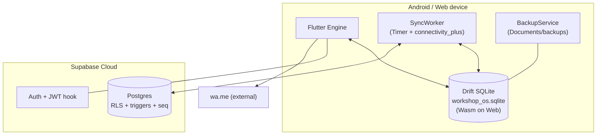

# Tech Stack — Garage Brain / Workshop OS

**Version:** 1.0.0 · **Date:** 2026-08-22  
**Principle:** one codebase, free-tier, offline-first, zero vendor cost.

---

## 1. Stack at a Glance

| Layer | Choice | Version (from `pubspec.yaml` / migrations) | Why |
|---|---|---|---|
| Language | **Dart 3.13** (Flutter 3.47.1) | `sdk: ^3.13.1` | Null safety, typed, single codebase |
| UI framework | **Flutter** | `flutter: sdk: flutter` 3.47.1 | Android + Web from one codebase |
| State / DI | **flutter_riverpod** | `^3.4.2` (`riverpod` transitively) | Scoped providers, testable, no BuildContext abuse |
| Navigation | **go_router** | `^17.5.0` | Declarative, `StatefulShellRoute` for bottom nav, pure `routeRedirect` testable (`routing/app_router.dart:27`) |
| Local store | **Drift** + **drift_flutter** + **sqlite3_flutter_libs** | `drift ^2.34.3`, `drift_flutter ^0.3.1`, `sqlite3_flutter_libs ^0.6.0+eol` | Typed schema mirror, reactive queries, Wasm on Web, `synced` queue (`data/drift/tables.dart:1`) |
| Backend | **Supabase** (Postgres + Auth + RLS) | `supabase_flutter ^2.17.2` | Free tier, no ops, Postgres triggers/RLS, custom JWT hook |
| IDs | **uuid** v4 client-generated | `^4.6.0` | Offline-safe PK (`tables.dart:12`) |
| Connectivity | **connectivity_plus** | `^7.3.1` | Sync trigger on `onConnectivityChanged` (`sync_worker.dart:41`) |
| Paths | **path_provider** | `^2.1.6` | Documents/support/tmp for DB + backups (`backup_service.dart:169`) |
| Deep link | **url_launcher** | `^6.3.2` | `wa.me` open (`features/job_detail/whatsapp.dart`) |
| Codegen | **drift_dev** + **build_runner** | `^2.34.5`, `^2.16.0` | `app_database.g.dart` generation |
| Lint | **flutter_lints** | `^6.0.0` | `analysis_options.yaml` gate |
| Test | **flutter_test** | SDK | In-memory Drift (`NativeDatabase.memory`) per `test/repositories/helpers.dart` |
| Migrations | **Supabase CLI** + plain SQL | `supabase/migrations/0001_init.sql`, `0002_rls.sql` | Append-only, `supabase db push/reset` |
| Backups | **BackupService/BackupScheduler** + `dart:io` | — | Daily file copy + weekly JSON export |
| Assets | **makes.csv** (29 makes) | — | `assets/makes.csv` → `pubspec.yaml:76` |

### Supabase objects (SQL, not package version)

| Object | Purpose |
|---|---|
| `customers`, `vehicles`, `car_ownership_history`, `job_cards`(+`closed`), `old_bills`, `recommendation_queue`, `profiles` | Core + Phase 2 stub |
| `job_status` enum, `job_no_seq`, `touch_updated_at()` trigger | Status + human-readable `JOB-xxxxxx` |
| `app_role()` + `auth.custom_access_token_hook(jsonb)` + RLS policies | JWT role + owner-only queue |

---

## 2. Justification & Alternatives

| Decision | Picked | Alternatives considered | Why picked |
|---|---|---|---|
| Cross-platform | Flutter | React Native / Native Android + Next.js | Single team, single typed schema, Web Wasm SQLite via same Drift code |
| State | Riverpod | Provider / Bloc / GetX | Providers are testable units; `*Providers` files sit next to screens; no global singletons |
| Local DB | Drift | sqflite / Hive / Isar | Drift mirrors Supabase schema 1:1, typed companions, reactive streams, migration support — matches `DESIGN.md §4` |
| Backend | Supabase | Firebase / Appwrite / Custom Node+PG | Free Postgres + RLS + hook; SQL migrations are durable truth (`supabase/migrations/`) |
| PK strategy | Client UUID | Server sequence only / ULID | Must insert offline; server seq is display number only |
| Notification | `wa.me` + `url_launcher` | SMS gateway / FCM / WhatsApp Cloud API | Zero cost & zero verification; receptionist-controlled |
| Docs site | VitePress-like static (chosen in `docs-site/`) | Docusaurus / MkDocs / plain HTML (see `DOCS_UI_PLAN.md`) | Fast Vite, Mermaid native, no React weight |

---

## 3. Runtime Architecture — Which Piece Runs Where



- **Web difference:** SQLite is Wasm (`app_database.dart:34`); file copy returns null — JSON export is primary backup.
- **Offline guarantee:** `Drift` is source of truth for reads; `Supabase` is durable convergence.

---

## 4. Toolchain & Gates

```bash
cd app
flutter pub get
dart run build_runner build --delete-conflicting-outputs   # after editing tables.dart
flutter analyze        # must pass clean (flutter_lints 6.0)
flutter test           # all suites green
flutter run -d chrome --dart-define=SUPABASE_URL=... --dart-define=SUPABASE_ANON_KEY=...
flutter build apk --dart-define=... / flutter build web --dart-define=...
```

`AGENTS.md §Task Execution Rules` enforces analyze+test per task. Migrations via `supabase db push` / `db reset`; Dashboard SQL Editor is fallback.

---

## 5. Dependencies — Direct vs Transitive Footprint

`pubspec.yaml:30` lists **10 runtime deps** — intentionally small:

- No `dio`/`http` duplicate — `supabase_flutter` bundles transport.
- No `hive`/`shared_preferences` — Drift covers all persistence (plus `path_provider` for files).
- No `freezed`/`json_serializable` — hand-written mappers (`sync_mappers.dart`) keep SyncWorker auditable.
- `uuid` only shared non-Flutter dart package.

Dev footprint is `flutter_test` + `flutter_lints` + `drift_dev`/`build_runner` — no test pyramid bloat.

---

## 6. Constraints Driven by Stack

- **No money fields** — enforced at schema (no `amount` column anywhere) and code (lint would fail on introduction).
- **No photo uploads** — no `image_picker`/`firebase_storage` in deps; would require justification if introduced.
- **Anon key only** — `AppConfig` reads `SUPABASE_URL` + `ANON_KEY` dart-defines; service key never in `pubspec.yaml` or code.
- **One writer** — LWW is valid; stack would need CRDT/vector clock only if multi-device receptionists appear (Phase 2 risk).

---

## 7. Upgrade Path (what NOT to adopt yet)

| Future need | Candidate | When |
|---|---|---|
| Rich text/complaint chips | chips data-driven from MVP free text (`DESIGN.md §3 Phase 2`) | After corpus collected |
| Recommendation cron | Python FastAPI writing `recommendation_queue` (`DESIGN.md §3`) | Tables already exist; cron is server-only, no app change except queue UI |
| Voice input | `speech_to_text` | Phase 2, Hindi/romanized |
| Analytics | Supabase `pg_cron` + dashboard queries | Phase 2 owner analytics |
| Docs search | Algolia/Local search on docs-site | When docs exceed 30 pages |
